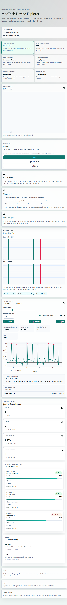

# MedTech Device Explorer

MedTech Device Explorer is an educational biomedical engineering website for learning how medical devices work. It uses realistic labeled machine photos, device-part explanations, signal and image processing demos, and fake/demo data only.

Live demo: https://mohanadzeyara.github.io/biomed-control-center/



Main learning sections:

- ECG Monitor
- CT Scanner
- Ultrasound System
- X-ray System
- MRI Scanner
- Infusion Pump
- Ventilator
- Defibrillator
- Hemodialysis Machine
- Video Endoscope

Each device section includes:

- A realistic labeled machine photo
- Clickable parts with functions and engineering details
- Electrotechnics links for sensors, amplifiers, ADCs, motors, filters, and power electronics
- Separate device pages using browser routes such as `#/device/ecg`
- English/German language toggle
- Light/dark mode toggle
- Animated teaching clips showing the device workflow
- A signal or image processing demonstration
- Workflow explanation from acquisition to display
- Engineering Deep Dive cards covering sensors, analog front ends, high-voltage electronics, magnetic fields, RF coils, gradients, reconstruction, control loops, and filtering
- Educational safety wording, with no diagnosis claims

Latest design pass:

- Reduced the wide side margins so the page uses more of the screen.
- Replaced the drawn/animated device visuals with realistic machine photos and clickable labels.
- Resolved the main device images to direct `upload.wikimedia.org` media URLs.
- Added real device thumbnails directly to the homepage cards.
- Added a stronger Google Font system with Syne headings and DM Sans body text.
- Added pulsing hotspot indicators and clearer tap/click guidance on device photos.
- Reviewed Claude's `medtech-improved.zip` and cherry-picked the stronger homepage photo-card layout with verified 500px thumbnails.
- Kept the ECG page categories: machine photo + parts, how it works, before/after results, and GET 1/2.
- Moved the ECG analysis lab into a dedicated ECG-only section so it does not feel mixed into every device.
- Pushed the ECG page closer to a Samsung-style product story with a real visual hero, highlights, close-up sections, signal chain, mini report, and then the normal study tabs.

Phase 1 includes:

- Dashboard overview with device status, alerts, and recent analysis
- Medical device digital twin cards
- Simulated ECG generator from the FastAPI backend
- Interactive ECG chart in React
- Simple heart-rate calculation from generated R peaks
- Learning notes for biomedical engineering concepts

Phase 2 additions now included:

- CSV ECG upload with time and voltage columns
- Optional smoothing filter for uploaded ECG data
- Basic R-peak detection for generated or uploaded ECG
- In-memory ECG analysis history
- Printable ECG report from the browser

## Tech Stack

- Frontend: React, TypeScript, Tailwind CSS, Plotly.js
- Backend: Python, FastAPI, NumPy
- Future database target: MongoDB

## Folder Structure

```text
biomed-control-center/
  backend/
    app/
      main.py
      demo_data.py
      ecg.py
    requirements.txt
  frontend/
    src/
      components/
      services/
      types/
    package.json
  ROADMAP.md
```

## Run Backend

```bash
cd backend
python -m venv .venv
.venv\Scripts\activate
pip install -r requirements.txt
uvicorn app.main:app --reload --port 8000
```

## Run Frontend

```bash
cd frontend
npm install
npm run dev
```

Open the frontend URL shown by Vite. The backend should be running at `http://localhost:8000`.

The deployed static demo can also run with browser fallback data if the FastAPI backend is not deployed yet.

## CSV Upload Format

The ECG upload accepts `.csv` or `.txt` files with two columns:

```csv
time,voltage
0,0.01
0.004,0.03
0.008,0.08
```

You can test it with `samples/demo_ecg.csv`.

## Safety Note

All device, ECG, sensor, and alert data is generated for education and demos. Do not use it for patient care or clinical decisions.
